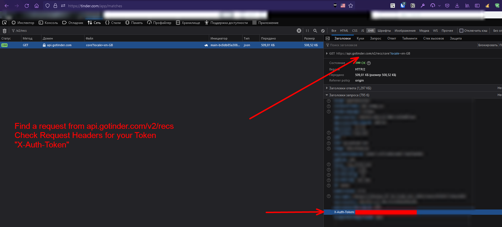

# Tinder API
### Unofficial API.

## Usage

```
import tinder_api.session

sess = tinder_api.session.Session()  # creates a session

sess.get_all_likes()

for match in sess.yield_matches():
    match.name  # all the same endpoints as a normal user
    match.match_data  # contains match data like messages/profile
    match.message("Hello, I use VIM so I am superior to all those other programmers you've dated")
    match.get_messages()
    
for user in sess.yield_users():
    user.name
    user.id
    user.age
    user.bio
    user.gender # male or female
    user.photos # url of the photos
    user.like() # swipe right
    user.pass() # swipe left
    user.super_like() # swipe up

    user.report(1) # report for spam
```

## AUTHENTICATION



### Authors / Acknowledgments
* [MMcintire96](https://github.com/MMcintire96)
* [sharkbound](https://github.com/sharkbound)
* [wowotek](https://github.com/wowotek)
